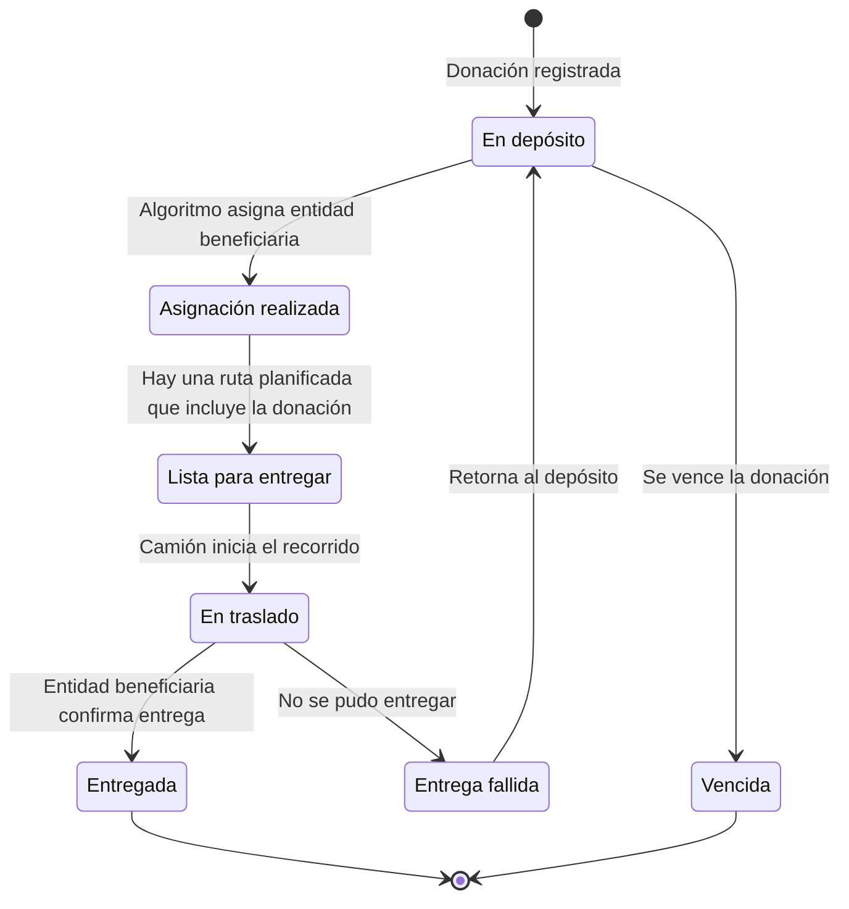

# DonaTrack - Sistema de Gestión y Trazabilidad de Donaciones

## Instrucciones para retomar el trabajo

- Antes de modificar código, leer [docs/estado-actual.md](docs/estado-actual.md). Contiene decisiones del equipo, cambios realizados, verificaciones y pendientes.
- Al finalizar una tarea, actualizar ese archivo con el estado real del trabajo. Distinguir lo implementado de lo propuesto y de los requisitos todavía pendientes.
- Trabajar únicamente sobre el proyecto raíz (`src/` y su `pom.xml`) y su documentación. No modificar `servicio-donaciones` ni `servicio-logistica` salvo indicación explícita del usuario.
- Corrección del docente: los controllers deben conectarse directamente con el dominio; el dominio orquesta el comportamiento. No introducir una capa de services que coordine los casos de uso ni trasladar esa coordinación a los controllers.
- El package `org.example.Routes` registra endpoints y los conecta con controllers. `LogisticaApplication` configura Javalin, instancia y conecta componentes, registra las rutas y arranca el servidor.
- Los pendientes funcionales registrados en el contexto fueron postergados por el usuario para priorizar la reestructura. No resolverlos como parte incidental de cambios de organización.
- Revisar el estado de Git antes de editar y conservar los cambios existentes. Las verificaciones anotadas corresponden a un momento concreto y no garantizan el estado futuro del código.

## Enunciados del TP

**Trabajo Práctico Anual Integrador — 2026**

Este README reúne los enunciados de las entregas 1, 2 y 3. Describe los requisitos del trabajo práctico, no el estado de implementación del proyecto. El diagrama de estados se transcribe a Mermaid; se omite la ilustración decorativa de portada.

## Índice

- [Contexto general](#contexto-general)
- [Entrega 1](#entrega-1)
- [Entrega 2](#entrega-2)
- [Entrega 3](#entrega-3)

## Contexto general

### Marco Institucional

UTN Solidaria es una iniciativa de la Subsecretaría de Asuntos Estudiantiles de nuestra Facultad, orientada a acompañar y asistir a personas en situación de vulnerabilidad a través de distintas acciones solidarias organizadas por estudiantes y voluntarios. Se constituye como un espacio de articulación entre estudiantes, docentes y graduados, con el propósito de canalizar acciones solidarias que generen un impacto positivo y sostenible en la sociedad.

El área busca complementar la formación académica de los futuros profesionales, impulsando valores como la responsabilidad social, la empatía y el trabajo colaborativo. En este marco, UTN Solidaria se posiciona como un puente entre la universidad y la comunidad, promoviendo la participación activa frente a problemáticas sociales y fomentando el desarrollo de soluciones concretas desde una perspectiva interdisciplinaria.

Entre sus principales líneas de acción se destaca el reparto de viandas a personas en situación de vulnerabilidad en los alrededores de la sede Medrano y de donaciones recibidas de alimentos no perecederos, ropa, abrigo, colchones y frazadas, el acompañamiento a instituciones educativas y comunitarias como el Hospital Gandulfo y un hogar de niños, y la generación de espacios de voluntariado que permitan a los participantes involucrarse de manera directa con diversos contextos sociales. Su trabajo se sostiene gracias al compromiso de los voluntarios y a las donaciones de quienes confían y acompañan cada una de las propuestas.

En el marco del presente trabajo práctico de grado, se propone analizar y modelar los distintos procesos que conforman UTN Solidaria, utilizando esta iniciativa como caso de estudio, y llevarla a la práctica mediante el diseño y desarrollo de una solución tecnológica que integre herramientas y enfoques propios de la Ingeniería en Sistemas de Información.

De este modo, se busca articular la formación tecnológica con el compromiso social, contribuyendo a la formación de profesionales no solo altamente capacitados, sino también conscientes de su rol en la sociedad y comprometidos con la transformación de su entorno.

### Contexto

Una organización sin fines de lucro dedicada a la recolección y distribución de donaciones de bienes materiales enfrenta dificultades para gestionar y dar trazabilidad a los recursos que recibe. La falta de un sistema unificado provoca desorden, duplicación de registros y poca claridad sobre el destino de las donaciones, perjudicando la transparencia y eficiencia.

### Nuestro sistema

A partir de la problemática identificada y presentada en la sección anterior, se propone el diseño y desarrollo de DonaTrack: una solución digital orientada a organizar, registrar y monitorear las donaciones desde su recepción en el depósito de la organización hasta su entrega a entidades beneficiarias que las requieran. El objetivo del sistema será mejorar la distribución de recursos y, al mismo tiempo, fortalecer la confianza de personas donantes y entidades beneficiarias de las donaciones.

## ENTREGA 1: Arquitectura y Modelado en Objetos - Parte I

### Objetivos de la entrega

- Entrar en contacto con el dominio y sus principales abstracciones.

- Incorporar de forma paulatina conceptos y principios de Diseño.

- Familiarizarse con el entorno de desarrollo y las principales tecnologías a ser aplicadas a lo largo del Trabajo Práctico.

- Familiarizarse con la arquitectura del sistema.

### Unidades del Programa Vinculadas

- Unidad 2: Herramientas de Concepción y Comunicación del Diseño.

- Unidad 3: Diseño con Objetos.

- Unidad 6: Diseño de Arquitectura.

- Unidad 8: Validación del Diseño.

### Alcance

- Donaciones - Gestión de Donantes y Donaciones.

- Donaciones - Importación masiva de donantes mediante archivo CSV.

- Donaciones - Gestión de Entidades Beneficiarias y Necesidades.

- Notificaciones - Primera iteración.

### Dominio

#### Donaciones - Donantes

Las personas donantes son personas humanas o jurídicas que desean aportar a las entidades beneficiarias. Estas podrán registrarse en la plataforma previo a llevar una donación al depósito. A las personas humanas se les solicita nombre, apellido, edad, número de documento, género y dirección y al menos un medio de contacto (en forma obligatoria correo electrónico y en forma opcional teléfono y/o WhatsApp). A su vez, podrá determinar cuál de ellos será su medio de contacto predeterminado para recibir notificaciones del sistema.

Por otra parte, las personas jurídicas deben indicar razón social, su tipo (Gubernamental, ONG, Empresa, Institución), rubro y al menos un medio de contacto. Cada organización tendrá personas representantes habilitadas a operar en su nombre.

#### Donaciones - Registro de personas donantes

Las personas donantes (o en caso de las jurídicas, un representante) se acercarán al depósito con el objetivo de ingresar una donación. En caso de que no tengan un usuario en la plataforma, una persona administradora les pedirá los datos de registro (ver sección anterior) y se les enviará un correo electrónico de bienvenida para que accedan por primera vez.

#### Donaciones - Donaciones y segmentación

Una vez registrada la persona donante, o confirmado que ya cuenta con un usuario, la persona administradora que esté en el depósito en ese momento completará el formulario de la donación en su nombre.

Se debe incluir una descripción general y los bienes que contiene. De cada bien se conoce una descripción y, opcionalmente, se le asocia una foto. Estos pertenecen a una categoría (mobiliario, alimentos, vestimenta, etc.). Para cada categoría existen múltiples subcategorías.

La subcategoría constituye la unidad mínima de asignación dentro del sistema, permitiendo identificar con precisión qué bien se necesita o se dona. Por ejemplo, dentro de la categoría “Alimentos” pueden definirse subcategorías como fideos secos, arroz, legumbres secas, aceite vegetal; y dentro de “Vestimenta” pueden existir subcategorías como camperas de abrigo, remeras, pantalones o ropa infantil.

Existen algunas categorías en las que es necesario conocer si su estado es usado o no, como por ejemplo en bienes mobiliarios o vestimenta. En caso de que los bienes sean perecederos, se debe ingresar la fecha de vencimiento. En todos los casos, se deberá contabilizar la cantidad de un mismo producto en una unidad determinada (kilogramos, unidades o según corresponda).

Se registrará la totalidad de los bienes a donar en una única carga dentro del sistema, a partir de la cual el sistema realizará automáticamente una segmentación interna, generando múltiples posibles donaciones independientes agrupadas obligatoriamente por subcategorías. De este modo, cada donación resultante quedará asociada a una única subcategoría, constituyendo la unidad mínima de asignación y garantizando coherencia en el proceso automático de vinculación con las necesidades correspondientes.

En el caso de bienes perecederos, el sistema podrá generar donaciones separadas cuando existan diferencias en la fecha de vencimiento. Asimismo, para aquellos bienes cuyo estado sea relevante (como mobiliario o vestimenta) deberá consignarse si se trata de artículos nuevos o usados, a fin de asegurar una correcta evaluación y asignación posterior.

Se proveen a continuación ejemplos concretos:

- La oficina corporativa de Arcos Plateados está en proceso de mudanza y quieren donar un conjunto de muebles usados: seis sillas y una mesa rectangular.

- Una planta industrial de pastas secas desea donar 100 paquetes de fideos y 50 tetra-packs de tomate que vencen el 01/01/2027.

#### Donaciones - Entidades beneficiarias y necesidades

Las entidades beneficiarias son organizaciones sin fines de lucro que se registran para recibir donaciones. Pueden ser escuelas rurales, comedores, espacios de tutoría de niños, entre otros. De cada entidad se conoce su razón social, dirección completa, teléfono y correos de las personas representantes designadas.

Las entidades beneficiarias podrán registrar sus necesidades materiales indicando subcategoría (sillas, ropa de abrigo, arroz, frutas, entre otros) y una breve descripción. La plataforma distinguirá entre necesidades recurrentes (consumos habituales) y extraordinarias (situaciones puntuales o emergencias).

- Necesidades extraordinarias: surgen ante situaciones excepcionales (como mudanzas, inundaciones, incendios o vencimientos próximos de insumos).

- Ejemplo: la escuela rural N°10, tras una inundación en un aula, necesita 30 bancos y 30 sillas para reponer la pérdida.

- La cantidad solicitada puede cubrirse mediante donaciones parciales. Por ejemplo, una persona dona 2 sillas, otra dona 20, y así sucesivamente hasta alcanzar las 30 sillas requeridas. La necesidad se considera satisfecha cuando se recibe una cantidad de bienes igualando o superando la cantidad requerida.

- Necesidades recurrentes: están vinculadas al funcionamiento habitual de la organización e implican bienes de consumo periódico. Se satisfacen dentro del período correspondiente (por ejemplo, mensual), según la cantidad objetivo definida para ese período.

- Ejemplo: el comedor infantil “Escobar Sonrisas” requiere 100 paquetes de fideos por semana para su funcionamiento habitual. La necesidad se satisface dentro de cada período (semanal), según la cantidad objetivo establecida.

#### Donaciones - Importación masiva de personas donantes por CSV

Dado que la ONG ya cuenta con un histórico de personas donantes, se debe  permitir la migración de su información en forma masiva importando un archivo .csv. Cada línea representará una persona donante (humana o jurídica) e incluirá los campos mínimos para identificarla y contactarla. En caso de que un registro ya exista (esto quiere decir que el correo electrónico ya se encuentra registrado en el servicio) se deberá actualizar su información; en caso contrario, se lo deberá crear el usuario.

El archivo posee el siguiente formato:

| TipoPersona | TipoDoc | Documento | Nombre/Razón Social | Email | Teléfono |
| --- | --- | --- | --- | --- | --- |
| HUMANA | DNI | 12345678 | Ana Pérez | ana@mail.com | +54 11 5555-5555 |
| JURIDICA | CUIT | 30-12345678-9 | Arcos Plateados S.A. | contacto@empresa.com | +54 11 4444-4444 |

Con estos datos debe ser posible ubicar a la persona donante en el sistema. En caso contrario, se le debe crear un usuario.

Se puede utilizar este [archivo de prueba](https://drive.google.com/file/d/1UOmqq0CZzBJdQ0SmdofQ2RNzcuCb61rp/view?usp=sharing) de 20.000 filas.

#### Donaciones - Estados de las donaciones

El sistema deberá garantizar la trazabilidad y auditoría de los estados de cada donación. Al momento de registrarse, la donación quedará en estado “En depósito”, lo que indica que está disponible para ser asignada a una entidad beneficiaria.

Al día siguiente, cuando se ejecute el algoritmo de asignación (situación que se describe en una posterior entrega), si la donación es asignada a una entidad beneficiaria quedará en estado “Asignación realizada”, en caso contrario permanece en el depósito.

La donación pasará a estar “Lista para entregar” cuando se haya planificado una ruta que incluya la donación. Pasará a “En traslado” cuando el camión asignado para la entrega haya iniciado el recorrido.  Finalmente, cuando la entidad beneficiaria haya confirmado su entrega, quedará en estado “Entregada”.

Si no se la pudo entregar el día estipulado, quedará en estado “Entrega fallida” y volverá al depósito. Si esto sucediera, se solicita registrar una justificación de por qué no se realizó la entrega, por ejemplo: “Tocamos timbre pero nadie respondió”. Las personas administradoras encargadas del depósito podrán cambiar el estado de una donación a “Vencida”, en caso de que sea necesario.

Figura 2 - [Diagrama de Estados de una donación.](https://drive.google.com/file/d/1-A44wwrcuuzcaC-UUhzi1MKrXzK4js-B/view?usp=sharing)

#### Notificaciones

Para esta entrega, se solicita exponer un componente notificador que, dado un destinatario, un mensaje y un medio de notificación (correo electrónico, SMS y WhatsApp), pueda realizar el envío. En esta iteración, se solicita simular la llamada a los servicios externos y marcar a las notificaciones como completadas. En próximas iteraciones se realizará la integración real.

### Requerimientos detallados

#### Requerimientos de dominio

- El sistema deberá permitir la gestión de personas donantes.

- El sistema deberá permitir la gestión de las donaciones resultantes.

- El sistema deberá permitir la gestión de entidades beneficiarias y sus necesidades.

- El sistema debe garantizar la trazabilidad de los estados de las donaciones, desde su recepción hasta su entrega.

- El sistema deberá permitir la importación masiva de donantes en CSV.

### Entregables

- Modelo del Dominio: diagrama de clases inicial que contemple las funcionalidades requeridas.

- Diagramas de Arquitectura: diagrama de despliegue, componentes y/o cualquier otro tipo de diagrama que refleje la arquitectura física y lógica de la entrega actual.

- Justificaciones de Diseño.

- Diagrama General de Casos de Uso.

- Implementación de los requerimientos.

## ENTREGA 2: Arquitectura y Modelado en Objetos - Parte II

### Objetivos de la entrega

- Diseñar e implementar, de manera incremental, las nuevas funcionalidades.

- Incorporar nociones de ejecuciones de tareas asincrónicas y/o calendarizadas.

- Familiarizarse con el concepto de APIs como mecanismo de integración y su consumo

- Exponer un servicio a través de un protocolo de red.

- Incorporar flujos de trabajo asincrónicos.

### Unidades del Programa Vinculadas

- Unidad 2: Herramientas de Concepción y Comunicación del Diseño.

- Unidad 3: Diseño con Objetos.

- Unidad 6: Diseño de Arquitectura.

- Unidad 7: Integración de Sistemas.

- Unidad 8: Validación del Diseño.

### Alcance

- Donaciones - Trazabilidad de las donaciones.

- Notificaciones - Integración concreta con distintos medios de notificación.

- Donaciones - Asignación de Necesidades Materiales.

- Logística - Entrega y planificación de rutas.

- Logística - Monitoreo de camiones en tiempo real.

- Exposición REST de los servicios.

### Dominio

#### Donaciones - Asignación de las donaciones

Por cada una de las donaciones cuyo estado sea “En Depósito”, el sistema debe ejecutar un proceso de matchmaking con el objetivo de asignar el destino de las mismas, es decir, a qué entidad beneficiaria será entregada.

Se cuenta con dos algoritmos (con la posibilidad de incorporar nuevos a medida que evolucione el sistema) que aplican un criterio distinto para evaluar a las entidades beneficiarias y genera un ranking en función de qué tanto corresponde que reciban la donación, de acuerdo con la lógica seleccionada. Estos algoritmos proponen hasta diez entidades beneficiarias que podrían recibir la donación. Hasta la actualidad estos son:

- Algoritmo de Compatibilidad Semántica: analiza la correspondencia entre las características del bien o bienes donado(s) y las necesidades declaradas por cada entidad beneficiaria. Favorece a aquellas organizaciones cuya demanda coincida de forma más precisa con la donación recibida.

- Algoritmo de Prioridad a sub-atendidos: asigna prioridad a organizaciones que hayan recibido menos donaciones en el último trimestre.

A partir de los resultados, este componente puede filtrar automáticamente las entidades beneficiarias que hayan aparecido en la ejecución de ambos algoritmos para que una persona administradora confirme el destino final. Si no hubo coincidencias, entonces mostrará ambas ejecuciones.

Para asegurarse de que la ejecución de los algoritmos no degrade el desempeño del sistema, se solicita que el mismo se realice en horarios de baja carga.

#### Eventos e integración con medios de notificación

El sistema deberá enviar notificaciones a personas donantes y entidades beneficiarias cuando ocurra un evento considerado relevante. Para esta entrega, se requiere notificar en los siguientes casos:

- Ausencia de la plataforma: A una persona donante, cuando no registre interacción con la plataforma durante más de 20 días, con el objetivo de incentivar a realizar una nueva donación

- Donación asignada (beneficiario): A una entidad beneficiaria, cuando se le asigna una donación en base a sus necesidades recurrentes o extraordinarias

- Donación asignada (donante): A una persona donante, cuando haya realizado una donación que acaba de ser asignada a una entidad beneficiaria

- Inicio de ruta: Se notificará a todas las entidades beneficiarias y a los donantes cuyas entregas formen parte de la ruta iniciada por el chofer. La notificación deberá incluir un enlace al mapa interactivo, permitiendo el seguimiento de la entrega en tiempo real.

- Entrega realizada con éxito: Cuando la entidad beneficiaria confirme la recepción satisfactoria de la donación, se notificará tanto a la entidad como al donante correspondiente. La notificación deberá incluir un comprobante de entrega, indicando fecha, hora y camión responsable.

- Entrega no satisfactoria: En caso de que la entrega no pueda concretarse por cualquier motivo (por ejemplo: vencimiento de los bienes previo a la entrega, imposibilidad de recepción por parte de la entidad, incidentes logísticos, etc.), se notificará a la entidad beneficiaria, a la persona donante y a personas administradoras del sistema. Si la entrega pudiera ser replanificada, se dejará constancia del estado correspondiente en el sistema y podrá generarse una nueva asignación de ruta para la donación en cuestión.

En esta iteración, además, se solicita que se envíen notificaciones reales a las personas usuarias involucradas, a través de correo electrónico, SMS y/o WhatsApp, basándose en la simulación realizada en la [entrega anterior](https://docs.google.com/document/d/1D8-lu1kpluW7gnQ2znQbO1N2Z2t_3TeXD1Vbdjp47kI/edit?tab=t.0).

#### Logística - Entrega y planificación de rutas

Para realizar las entregas, la organización cuenta con una flota de camiones. De cada uno se conoce la patente, la capacidad en volumen (m³), la altura (m) y la capacidad de carga (kg). Todos los camiones pueden transportar cualquier tipo de bien y parten siempre desde el depósito para realizar las entregas del día.

La plataforma contará con la integración de un componente externo encargado de generar las rutas de reparto del día siguiente para la flota. Este componente recibirá, por ejecución, un conjunto de donaciones en estado Asignación Realizada junto con la información de los camiones disponibles. Devolverá, por cada camión, una lista ordenada de destinos (direcciones de las entidades beneficiarias) con las entregas que debe realizar en cada una. Al completar la planificación, las rutas asignadas quedan disponibles para los choferes en su aplicación.

#### Logística - Trazabilidad de las entregas de las donaciones

Antes de iniciar el recorrido, el chofer deberá indicar en el sistema que dará por inicio su ruta. Automáticamente, las entregas asignadas pasarán al estado “En traslado”. Cuando el camión entregue la donación en la sede de la entidad beneficiaria, esta deberá confirmar la recepción en el sistema. La entrega pasará al estado “Entregada” y quedará registrado qué camión realizó la entrega. Luego, la entidad deberá cargar fotos de la donación recibida en la plataforma.

Si la entidad informa que no recibió la entrega en el día correspondiente, la misma se marcará como “No recibida”. El caso será revisado por las personas administradoras. Si la donación regresa al depósito, la entrega volverá al estado “Pendiente”.

#### Logística - Monitoreo de camiones en tiempo real

Para permitir el seguimiento en tiempo real de las entregas por todos los interesados, el sistema deberá mostrar en un dashboard administrativo la posición actual de los camiones y su avance sobre la ruta asignada en tiempo real. El equipo encargado de los dispositivos y herramientas de campo ha propuesto dos alternativas para obtener la posición del camión en tiempo real:

- Dispositivo GPS configurable instalado en el camión, que enviará periódicamente la ubicación y velocidad.

- Aplicación móvil utilizada por el conductor, que reportará la geolocalización mientras la ruta esté activa.

Ambas opciones permiten cumplir con el objetivo funcional de monitoreo en tiempo real. Se deberá elegir una de las dos alternativas y continuar el desarrollo en función de la decisión adoptada, definiendo el contrato de integración correspondiente.

La configuración de los dispositivos físicos o de la aplicación móvil será responsabilidad del equipo externo. La plataforma deberá recibir, validar y procesar la información enviada para reflejar correctamente el estado del recorrido en el dashboard.

#### Integración entre Servicios

Debido a que se prevee que el tamaño del equipo de desarrollo crecerá pronto, se desea organizarlo en dos equipos. Por ello, se solicita que se divida al sistema en, inicialmente, dos microservicios; sus responsabilidades y las interacciones entre ellos formarán parte de las decisiones de diseño que deberá tomar cada equipo.

#### Exposición REST de los servicios

La integración entre los servicios identificados en el punto anterior deberá ser realizada empleando el protocolo HTTP y siguiendo las convenciones REST. A

Donaciones - Gestión de Personas Donantes y Donaciones:

- Operaciones CRUD sobre las donaciones.

- Operaciones CRUD sobre las personas donantes (jurídicas y humanas).

- Cambios de estado de una donación, garantizando trazabilidad y auditoría.

Donaciones - Gestión de Entidades Beneficiarias y Necesidades:

- Operaciones CRUD sobre las entidades beneficiarias.

- Operaciones CRUD sobre las necesidad materiales (recurrentes y extraordinarias)

- Obtención del ranking generado por los algoritmos de asignación y selección de entidad beneficiaria final.

- Ejecución a demanda de los algoritmos de asignación de necesidades.

Logística:

- Gestión de flota de camiones.

- Operaciones CRUD sobre las rutas y entregas.

### Requerimientos detallados

#### Requerimientos de dominio

- El sistema debe garantizar la trazabilidad de los estados de las donaciones, desde su recepción hasta su entrega.

- El sistema debe garantizar el envío de notificaciones por distintos medios ante registro de inactividad por parte de una persona donante,  asignación de donaciones a la entidad beneficiaria, inicio de rutas de las entregas y estado de las entregas.

- El sistema debe garantizar la ejecución asincrónica de los algoritmos de asignación de donaciones presentes en el depósito.

- El sistema debe permitir la realización de operaciones a través de los endpoints solicitados, mediante el desarrollo de una API REST.

- El sistema debe, en horarios de baja carga, generar los planes de rutas para los camiones durante la siguiente jornada operativa, integrándose con el componente externo provisto.

- El sistema debe permitir a los choferes de los camiones informar del comienzo de su ruta.

- El sistema debe mostrar en tiempo real tanto a la persona donante como a la entidad beneficiaria de la donación la localización de los camiones para poder estar al tanto de su llegada.

- El sistema debe gestionar la recepción de la entrega por parte de las entidades beneficiarias en todos los casos.

#### Requerimientos de implementación

- Para que la integración con el servicio externo de planificación de rutas funcione, el sistema deberá exponer una URL de callback donde el componente externo podrá notificar el resultado de la planificación. La llamada de retorno permitirá que la plataforma registre las rutas generadas y actualice el estado de las entregas que hayan sido efectivamente asignadas.

- El sistema deberá realizar las solicitudes al proveedor en lotes puesto que, por restricciones del proveedor, cada ejecución procesa como máximo 100 donaciones a entregar.

- Es posible que el planificador no pueda asignar todas las donaciones en una única ruta. En ese caso, devolverá las donaciones sin asignar en un campo aparte, y será responsabilidad de nuestro sistema volver a planificarlas.

### Entregables

- Modelo del Dominio: diagrama de clases que contemple las funcionalidades requeridas.

- Diagrama de despliegue y diagrama de clases actualizados

- Justificaciones de Diseño: Explicaciones, Documentos y Diagramas Complementarios que considere el equipo. Prestar especial atención a justificar la estrategia de división en microservicios aplicada

- Implementación de requerimientos de la entrega actual.

## ENTREGA 3: Persistencia

### Objetivos de la entrega

- Incorporar nociones de persistencia de datos en un medio relacional.

- Incorporar nociones de la técnica de mapeo objeto – relacional.

- Incorporar nociones de desnormalizaciones del modelo relacional

### Unidades del Programa Vinculadas

- Unidad 2: Herramientas de Concepción y Comunicación del Diseño

- Unidad 5: Diseño de Datos y Estrategias de Persistencia

- Unidad 6: Diseño de Arquitectura

- Unidad 8: Validación del Diseño

### Alcance

- Persistencia del modelo de objetos previamente generado

- Normalización de la información

### Requerimientos detallados

- Se deberán persistir las entidades del modelo planteado. Para ello se debe utilizar un ORM.

- Tener en cuenta que cada servicio tiene que tener su propio esquema de datos, y las entidades no deben ser compartidas.

- En caso de no haberse separado anteriormente los servicios, estos deberán estar separados en dos proyectos distintos.

### Entregables

- Modelo del Dominio: actualización del modelo de Diagrama de Clases con las funcionalidades previstas en esta entrega.

- Justificaciones de Diseño: Documento y Diagramas Complementarios.

- Modelo de datos: diagrama de entidad-relación físico.

- Justificaciones y Consideraciones de Diseño Relacional.

- Implementación en código de los requerimientos de la presente entrega, utilizando JPA, el paquete jpa-extras y las bases HSQLDB (para el testing) y una base de datos multiplataforma, cliente servidor, de código abierto (PostgreSQL/MariaDB) para el despliegue local.
